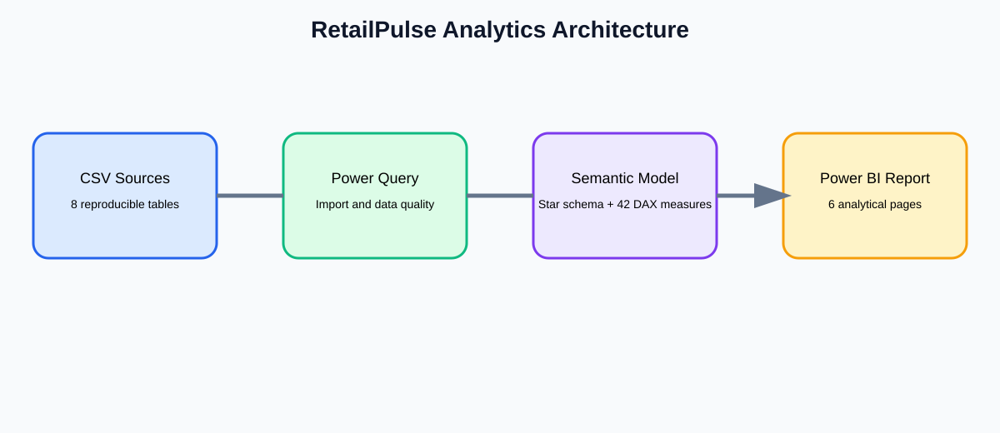
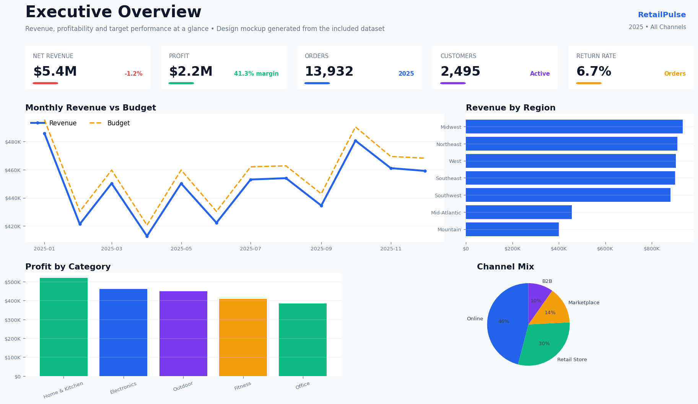
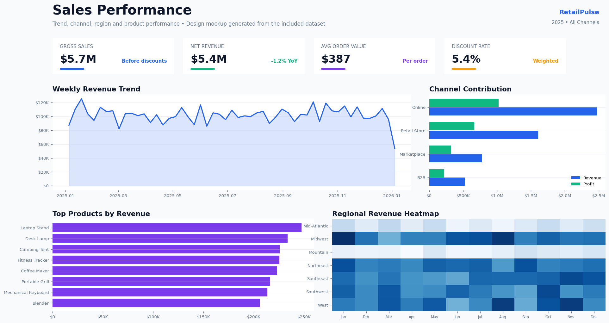
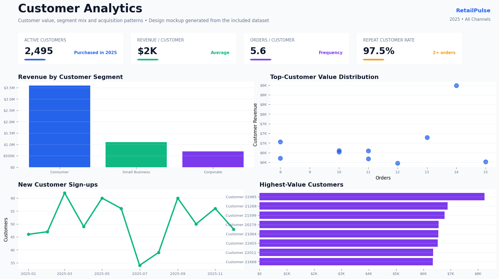
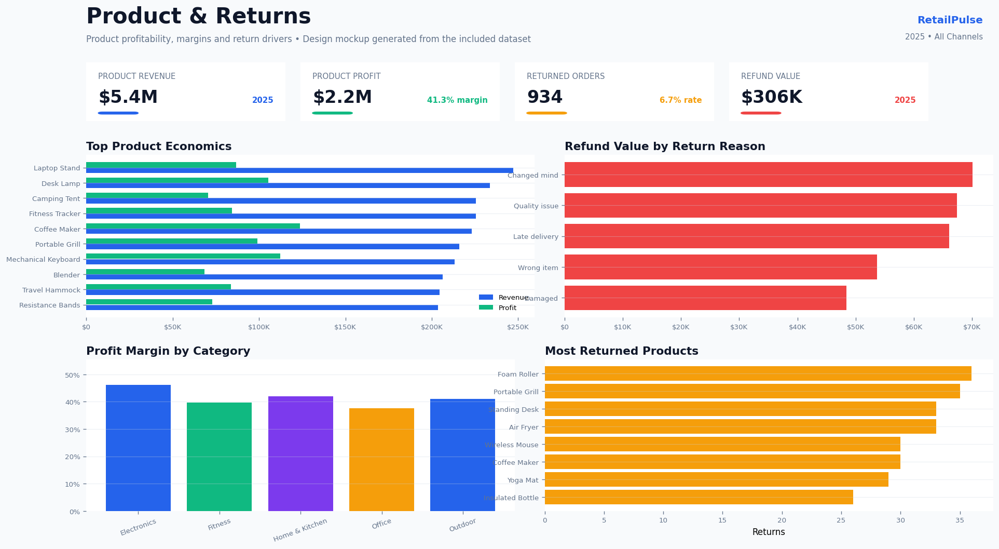

# RetailPulse Enterprise Analytics

   

A portfolio-ready, source-controlled Power BI business intelligence solution for a fictional omnichannel retailer. It analyzes revenue, profitability, customers, products, returns, regional performance and budgets across 2023–2025.



## Portfolio highlights
- 42,000 synthetic order lines and 2,500 customers
- Eight-table analytical model with two fact tables plus budget
- 42 documented DAX measures
- Revenue, profit, margin, target, customer, product and return analytics
- SQL schema and advanced analytical queries
- PBIP/TMDL source files suitable for Git diffs
- Automated GitHub Actions repository validation
- No confidential or proprietary data

## Open locally — no manual path replacement
1. Clone or download this repository. Read `OPEN_FIRST_How_to_Run.md` for the complete beginner-friendly guide.
2. Run one setup command from the repository root:

**Windows PowerShell**
```powershell
./scripts/configure_project.ps1
```

**macOS/Linux or Windows with Python**
```bash
python scripts/configure_project.py
```
3. Open `Dashboard/RetailPulse.pbip` in Power BI Desktop and refresh.
4. Import `assets/RetailPulse_Theme.json`.

The setup script automatically writes the correct local `Data` folder into the semantic model. You never need to search for or manually replace a file path. The repository itself can be uploaded to GitHub immediately as provided.

## Dashboard pages
1. Executive Overview
2. Sales Performance
3. Customer Analytics
4. Product & Returns
5. Regional Performance
6. KPI Explorer


## Dashboard design preview

The following presentation-ready images are static design mockups generated from the included synthetic dataset. They show the intended Power BI visual direction and are suitable for GitHub and portfolio website presentation.

### Executive Overview


### Sales Performance


### Customer Analytics


### Product & Returns


> These are design mockups rather than screenshots exported from a live Power BI report. Power BI Desktop is required to assemble the final interactive canvas.

## Repository structure
```text
Dashboard/       PBIP report and TMDL semantic model
Data/            Eight synthetic CSV source tables
DAX/             Complete measure catalog
SQL/             Database schema and analytical queries
PowerQuery/      ETL and transformation documentation
Documentation/   Dashboard guide, case study and data dictionary
Images/          Architecture and portfolio visuals
scripts/         Automatic local path configuration
.github/         CI validation workflow
```

## Data model
The model uses a star-schema approach. Sales is the primary transaction fact table. Returns and Budget provide complementary business processes. Date, Product, Customer, Region and Employee dimensions provide reusable filtering.

## Featured DAX
```DAX
Revenue YoY % =
DIVIDE([Total Revenue] - [Revenue Previous Year], [Revenue Previous Year])

Return Rate % =
DIVIDE([Return Orders], [Orders])

Revenue Attainment % =
DIVIDE([Total Revenue], [Revenue Budget])
```

## Important note
Power BI Desktop is required to render and interact with the report. This repository contains editable PBIP/TMDL source, data, DAX, SQL and documentation rather than a binary `.pbix` file.

## License
MIT. Synthetic data may be reused for learning and portfolio demonstration.
